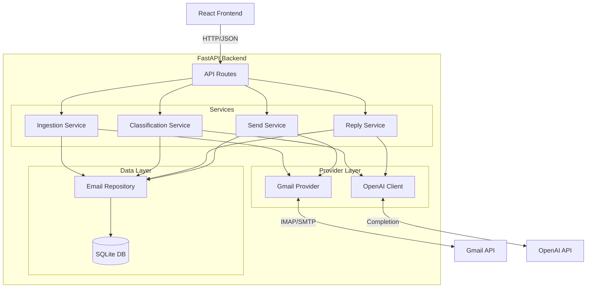
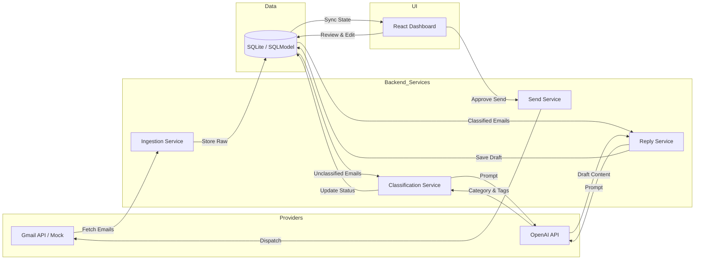

# Prema Inbox Triage AI
Production-grade FastAPI + React/Vite automation platform that syncs Gmail inboxes, classifies messages with LLMs, and drafts actionable replies.

> Built by **Prema Vision LLC**, an AI automation consultancy led by **Denys Korolkov**.

## ⭐ Live Demo
- **Web UI:** https://prema-inbox-triage-ai.vercel.app
- **API docs (Swagger):** https://prema-inbox-triage-ai.onrender.com/docs

## ⭐ Loom Walkthrough
LOOM_WALKTHROUGH: <loom link placeholder>

## ⭐ Screenshots
SCREENSHOTS: <folder or individual images placeholder>

---

## Elevator Pitch
Inbox Triage AI solves the "buried lead" problem by converting chaotic email streams into structured, actionable workflows. The system ingests messages, applies LLM classification (Lead, Support, Spam), and auto-drafts context-aware replies.

Operators manage the process via a dedicated "human-in-the-loop" dashboard, enabling review and approval in seconds—combining automation speed with operational control.

## Why This Project Matters
For businesses drowning in inbound communications, this architecture demonstrates a scalable path to automation:
- **Sales Ops:** Instantly flag high-value leads and draft initial outreach, reducing speed-to-lead time.
- **Support Ops:** Auto-triage tickets and draft responses to common queries, freeing agents for complex issues.
- **Engineering Quality:** Shows how to build AI agents that are testable, observable, and reliable—moving beyond fragile scripts to production-grade software.

## Core Features
- **Dual-Mode Sync Engine:** Seamlessly switches between real Gmail OAuth integration and a rich Mock Generator for safe demos and testing.
- **AI Classification Pipeline:** Uses OpenAI (GPT-4o) to categorize emails by intent, priority, and sentiment, while extracting key entities.
- **Context-Aware Drafting:** Automatically generates reply drafts based on email context and historical patterns.
- **Operational Dashboard:** Dedicated React/Vite dashboard for reviewing classifications, editing drafts, and managing inbox state.
- **Robust Persistence:** SQLModel (SQLite) backend ensures data consistency, audit trails, and easy state management.
- **Developer Experience:** Fully typed codebase (Python/TypeScript), dependency injection, and comprehensive E2E testing (Playwright).

## Architecture Overview
The system follows a domain-driven design with a clear separation of concerns. A FastAPI backend orchestrates the ingestion, classification, and response workflows, identifying clear boundaries between external providers (Gmail, OpenAI) and core business logic.



## Data Flow / AI Flow


## Tech Stack
| Layer | Technologies |
| --- | --- |
| **Backend** | Python 3.12, FastAPI, SQLModel, Pydantic, Poetry |
| **AI & Data** | OpenAI API (GPT-4o), SQLite, Vector embeddings (optional integration-ready) |
| **Frontend** | React 18, TypeScript, Vite, CSS Modules, Axios |
| **Testing** | Pytest, Playwright, Unittest |
| **DevOps** | GitHub Actions, Docker (implied), Environment Config Management |

## Setup & Running

### 1. Backend Setup
```bash
# Install dependencies
poetry install

# Configure environment
cp .env.example .env
# Edit .env to set OPENAI_API_KEY and GMAIL_USE_MOCK=True for testing
```

### 2. Frontend Setup
```bash
cd frontend
npm install
```

### 3. Run the System
```bash
# Terminal 1: Start Backend
poetry run uvicorn app.main:app --reload

# Terminal 2: Start Frontend
cd frontend
npm run dev
```
Access the dashboard at `http://localhost:5173`.

## How to Use (Step-by-Step Demo Flow)
1.  **Sync Inbox:** Click "Sync" to fetch recent emails. If in Mock mode, this generates realistic test scenarios.
2.  **AI Processing:** Watch as the system automatically classifies emails as "Sales", "Support", or "Noise".
3.  **Review Drafts:** Click on a "Sales" lead to see the AI-suggested reply.
4.  **Human Override:** Edit the draft inline to add a personal touch.
5.  **Send:** Click "Send Reply" to dispatch the email (logs to console in Mock mode, sends via API in Real mode).
6.  **Retriage:** Use the "Retriage" button to force a re-evaluation if the context changes.

## API Examples
The API is fully documented via Swagger UI at `http://localhost:8000/docs`.

**Sync Emails:**
```bash
POST /emails/sync
{
  "limit": 5
}
```

**Get Email Details:**
```bash
GET /emails/{email_id}
```

**Send Reply:**
```bash
POST /emails/{email_id}/send
{
  "body": "Updated reply content..."
}
```

## Who This Is For
- **CTOs & Founders:** Evaluating build-vs-buy for internal AI operations tools.
- **Enterprise Architects:** Looking for reference patterns on integrating LLMs into legacy workflows safely.
- **Consultants:** Demonstrating the capability to deliver end-to-end AI automation, not just chat interfaces.

## Extensibility & Future Enhancements
- **Multi-Provider Support:** Abstracted provider pattern allows easy addition of Outlook (Graph API) or HubSpot.
- **RAG Integration:** Connect `ReplyService` to a vector database to draft answers based on company knowledge bases.
- **Background Workers:** Move LLM processing to Celery/Redis for high-volume non-blocking throughput.
- **WebSockets:** Implement real-time frontend updates as emails are processed.

## Contact
For collaboration, consulting, or questions:
Denys Korolkov — Prema Vision LLC
📧 denys@premavision.net
🌐 https://premavision.net
